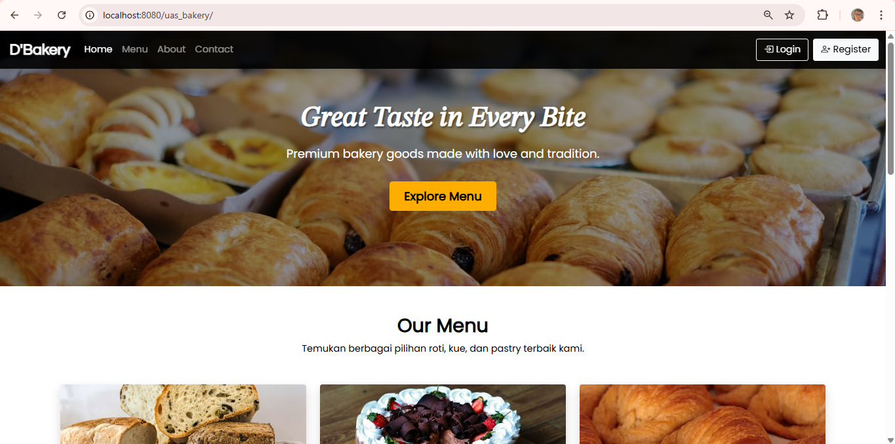
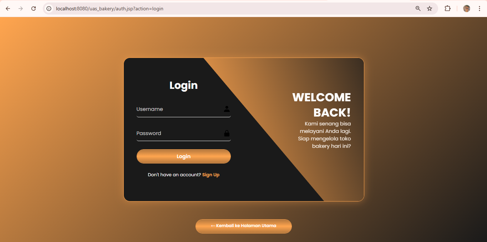
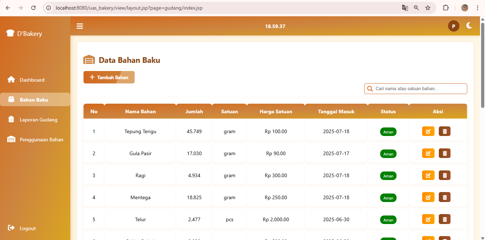
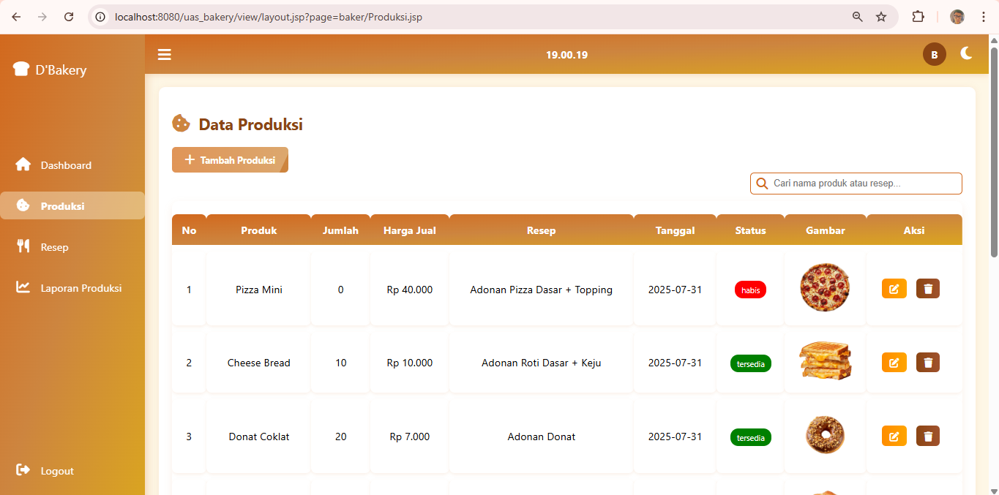
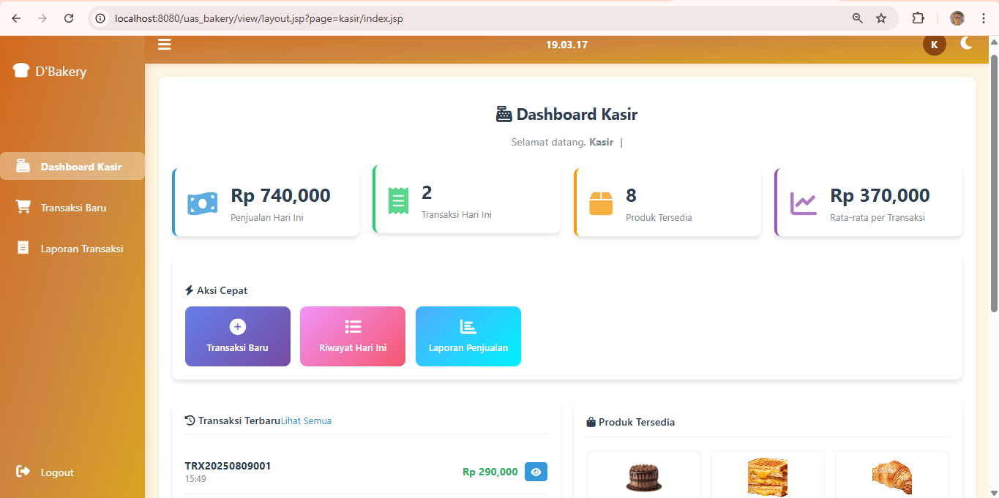

# 🍞 Sistem Manajemen Stok Bakery

[](https://openjdk.org/)
[](https://ant.apache.org/)
[](https://tomcat.apache.org/)
[](https://www.mysql.com/)
[](https://developer.mozilla.org/en-US/docs/Web/HTML)
[](https://developer.mozilla.org/en-US/docs/Web/CSS)
[](https://developer.mozilla.org/en-US/docs/Web/JavaScript)
[](https://netbeans.apache.org/)

## 📝 Deskripsi

Sistem Manajemen Stok Bakery adalah aplikasi web berbasis Java yang dirancang khusus untuk membantu pengelolaan inventaris dan operasional toko roti. Aplikasi ini memiliki tiga role utama: **Gudang** untuk manajemen stok dan bahan baku, **Baker** untuk produksi dan quality control, dan **Kasir** untuk penjualan dan transaksi pelanggan.

## ✨ Fitur Utama

### 🛍️ Manajemen Produk
- Tambah, edit, dan hapus produk bakery
- Kategorisasi produk (roti, kue, pastry, dll.)
- Upload dan manajemen gambar produk
- Pengaturan harga dan informasi produk

### 📦 Manajemen Stok
- Monitoring stok real-time
- Pencatatan stok masuk dan keluar
- Notifikasi stok minimum
- Tracking expired date produk
- Laporan pergerakan stok

### 🏭 Modul Baker (Produksi)
- Input produk hasil produksi
- Manajemen resep dan bahan baku
- Jadwal produksi harian
- Quality control checklist

### 🏪 Modul Kasir (Penjualan)
- Point of Sale (POS) system
- Pencatatan transaksi penjualan
- Management customer dan member
- Laporan penjualan harian

### 📦 Modul Gudang (Warehouse)
- Manajemen stok bahan baku
- Monitoring inventory
- Stock opname dan audit
- Supplier management

### 👥 Manajemen User
- Sistem login dan autentikasi
- Role-based access control (Gudang, Baker, Kasir)
- Profil pengguna dan pengaturan akun

### 📊 Laporan dan Analytics
- Laporan penjualan harian/bulanan (Kasir)
- Laporan produksi dan yield (Baker)
- Laporan stok dan inventaris (Gudang)
- Analytics produk terlaris
- Export laporan ke PDF/Excel per role

### 🔔 Notifikasi
- Alert stok rendah (Gudang)
- Target produksi harian (Baker)
- Peringatan produk mendekati expired
- Notifikasi transaksi penting (Kasir)

## 🛠️ Teknologi yang Digunakan

### Backend
- **Java 21** - Bahasa pemrograman utama
- **Apache Tomcat 11** - Web server dan servlet container
- **Java Servlets & JSP** - Web application framework
- **JDBC** - Database connectivity
- **MySQL** - Database management system
- **Apache Ant** - Build automation tool

### Frontend
- **HTML5** - Markup language
- **CSS3 Custom** - Custom styling (hand-written)
- **JavaScript** - Client-side scripting

### Development Tools
- **NetBeans IDE** - Integrated Development Environment
- **Apache Ant** - Build system
- **MySQL Workbench** - Database management

## 📋 Prerequisites

Pastikan sistem Anda telah terinstall:

- Java Development Kit (JDK) 21
- Apache Tomcat 11
- Apache Ant
- MySQL Server 8.0+
- NetBeans IDE (recommended)
- Web browser modern

## ⚡ Instalasi dan Setup

### 1. Clone Repository
```bash
git clone https://github.com/littlesuccumb/Sistem-Manajemen-Stok-Bakery.git
cd Sistem-Manajemen-Stok-Bakery
```

### 2. Setup Database
```sql
-- Buat database MySQL
CREATE DATABASE uas_bakery;

-- Import struktur database (jika ada file SQL)
mysql -u root -p uas_bakery < database/uas_bakery.sql
```

### 3. Konfigurasi Database
Edit konfigurasi database di project Anda (biasanya di file koneksi):
```java
// Database Configuration
String url = "jdbc:mysql://localhost:3306/uas_bakery";
String username = "your_username";
String password = "your_password";
```

### 4. Setup di NetBeans
1. Buka NetBeans IDE
2. Import project: File → Open Project
3. Pilih folder project Anda
4. Konfigurasi Tomcat 11:
   - Tools → Servers → Add Server
   - Pilih Apache Tomcat
   - Browse ke instalasi Tomcat 11
5. Set sebagai default server

### 5. Build dan Run
```bash
# Build menggunakan Ant
ant clean
ant compile
ant build

# Atau run langsung dari NetBeans (F6)
```

### 6. Deploy ke Tomcat
- Right-click project → Deploy
- Atau copy WAR file ke folder webapps Tomcat

## 👤 Default Login

### Gudang (Warehouse)
- **Username:** gudang1
- **Password:** g123

### Baker (Production)
- **Username:** baker1
- **Password:** b123

### Kasir (Cashier)
- **Username:** kasir1
- **Password:** k123

> ⚠️ **Penting:** Segera ubah password default setelah login pertama kali!

## 📁 Struktur Project

```
Sistem-Manajemen-Stok-Bakery/
├── web/                           # Web Root Directory
│   ├── WEB-INF/
│   │   ├── web.xml               # Deployment Descriptor
│   │   └── lib/                  # JAR Libraries
│   ├── css/                      # Custom CSS Files
│   ├── js/                       # JavaScript Files
│   ├── images/                   # Image Assets
│   ├── pages/                    # JSP Pages
│   │   ├── gudang/              # Gudang Pages
│   │   ├── baker/               # Baker Pages
│   │   └── kasir/               # Kasir Pages
│   └── index.jsp                # Home Page
├── src/                          # Java Source Files
│   └── java/
│       ├── controller/          # Servlet Controllers
│       ├── model/               # Java Beans/Models
│       ├── dao/                 # Database Access Objects
│       ├── util/                # Utility Classes
│       └── config/              # Configuration Classes
├── nbproject/                    # NetBeans Project Files
├── build.xml                    # Ant Build Configuration
└── README.md
```

## 📸 Screenshot

### Homepage


### View Login


### View Gudang


### View Baker


### Dashboard Kasir



## 🔧 Konfigurasi Tambahan

### Konfigurasi Tomcat Context
Buat file `META-INF/context.xml` untuk konfigurasi database pool:
```xml
<?xml version="1.0" encoding="UTF-8"?>
<Context>
    <Resource name="jdbc/uas_bakery" 
              auth="Container"
              type="javax.sql.DataSource"
              maxTotal="20" 
              maxIdle="5"
              maxWaitMillis="10000"
              username="your_username" 
              password="your_password"
              driverClassName="com.mysql.cj.jdbc.Driver"
              url="jdbc:mysql://localhost:3306/uas_bakery"/>
</Context>
```

### Konfigurasi web.xml
```xml
<web-app>
    <resource-ref>
        <description>DB Connection</description>
        <res-ref-name>jdbc/uas_bakery</res-ref-name>
        <res-type>javax.sql.DataSource</res-type>
        <res-auth>Container</res-auth>
    </resource-ref>
</web-app>
```

## 🧪 Testing

```bash
# Build dan test dengan Ant
ant clean
ant compile
ant test

# Deploy untuk testing
ant deploy
```

## 🤝 Kontribusi

Kontribusi sangat diterima! Untuk berkontribusi:

1. Fork repository ini
2. Buat branch fitur baru (`git checkout -b feature/AmazingFeature`)
3. Commit perubahan (`git commit -m 'Add some AmazingFeature'`)
4. Push ke branch (`git push origin feature/AmazingFeature`)
5. Buat Pull Request

## 📋 Roadmap

- [ ] Implementasi barcode scanner
- [ ] Mobile responsive design
- [ ] Multi-branch support
- [ ] Advanced analytics dashboard
- [ ] Integration dengan POS system
- [ ] Automated backup system

## ⚠️ Troubleshooting

### Common Issues

**1. Database Connection Error**
```bash
# Check MySQL service status
sudo service mysql status
# Restart if needed
sudo service mysql restart

# Verify database exists
mysql -u root -p
USE uas_bakery;
```

**2. Port 8080 sudah digunakan**
```bash
# Change Tomcat port di server.xml
# <Connector port="8081" protocol="HTTP/1.1"
```

**3. Build Error dengan Ant**
```bash
# Clean dan rebuild
ant clean
ant compile
ant build

# Check classpath di NetBeans
# Project Properties → Libraries
```

**4. JSP tidak load**
- Pastikan JSP file ada di folder `web/`
- Check web.xml servlet mapping
- Verify Tomcat JSP engine aktif

## 📄 Lisensi

Distributed under the MIT License. See `LICENSE` for more information.

## 👨‍💻 Developer

**[Your Name]** - [@littlesuccumb](https://github.com/littlesuccumb)

Project Link: [https://github.com/littlesuccumb/Sistem-Manajemen-Stok-Bakery](https://github.com/littlesuccumb/Sistem-Manajemen-Stok-Bakery)

## 🙏 Acknowledgments

- [Java Documentation](https://docs.oracle.com/en/java/)
- [Apache Tomcat Documentation](https://tomcat.apache.org/tomcat-11.0-doc/)
- [NetBeans IDE](https://netbeans.apache.org/)
- [MySQL Documentation](https://dev.mysql.com/doc/)
- [Apache Ant Manual](https://ant.apache.org/manual/)

---

**📞 Support:** Jika mengalami masalah atau membutuhkan bantuan, silakan buat issue di repository ini atau hubungi developer.

**⭐ Star this repository jika project ini membantu Anda!**
